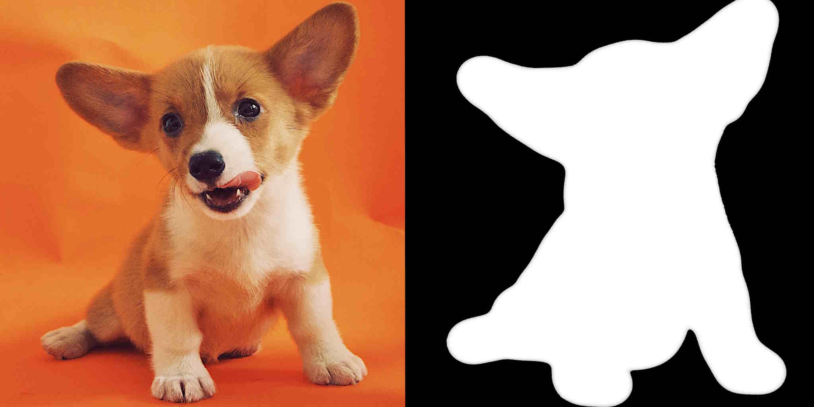
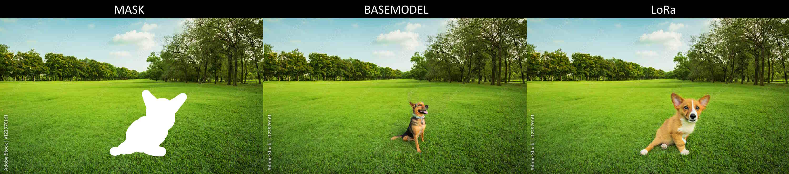
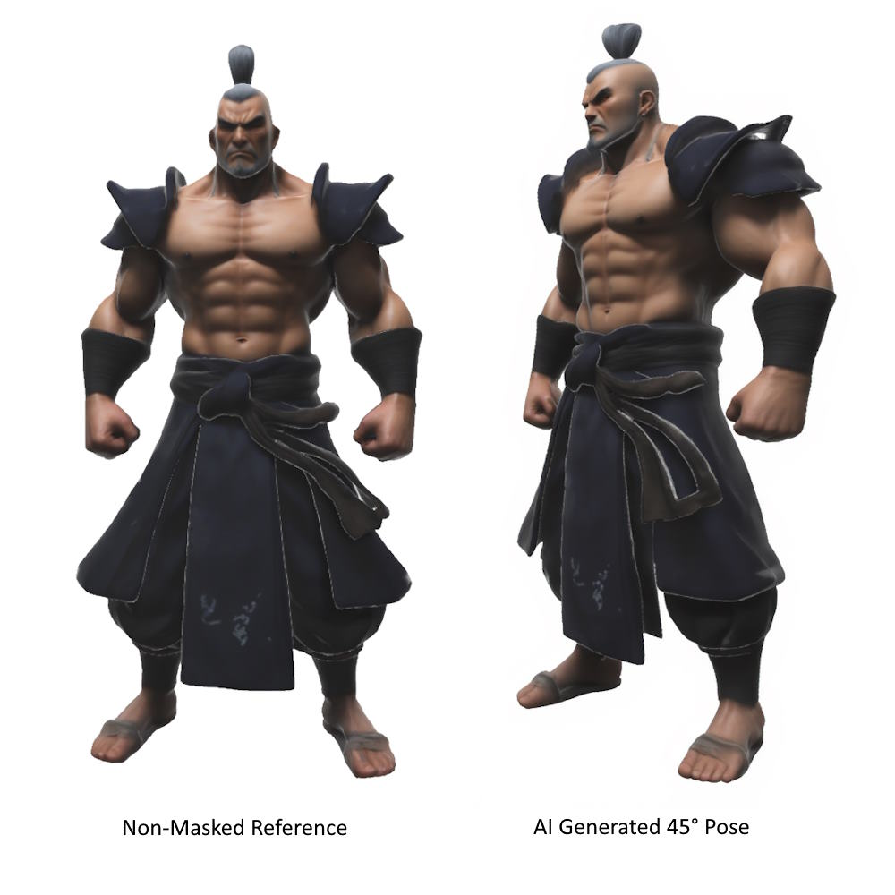

<!---
Copyright 2022 - The HuggingFace Team. All rights reserved.

Licensed under the Apache License, Version 2.0 (the "License");
you may not use this file except in compliance with the License.
You may obtain a copy of the License at

    http://www.apache.org/licenses/LICENSE-2.0

Unless required by applicable law or agreed to in writing, software
distributed under the License is distributed on an "AS IS" BASIS,
WITHOUT WARRANTIES OR CONDITIONS OF ANY KIND, either express or implied.
See the License for the specific language governing permissions and
limitations under the License.
-->

# FLUX-Fill-LoRa-Training

This repository provides a fork of the [🤗 Diffusers](https://github.com/huggingface/diffusers) library with an example script for LoRA training on the new **FLUX.1-Fill** models. FLUX has very strong in-context capabilites, making it a suitable choice for a range of tasks, beside classical character LoRa training.

> **Note**: The script isn't optimized and was just tested on an NVIDIA A100 GPU (80GB VRAM). If anyone has a similar script for frameworks like SimpleTuner or SD-scripts, that runs on consumer hardware, I would be more than happy to hear!

## Overview

In order to use this script you need to have a dataset of images and the corresponding masks for inpainting. The masks are simple black images with the white spots for the inpainting area as can be seen in the example below. The corresponding mask needs to have the same filename as the original image. If you have a specific masking strategy, like masking just the right half of the image or applying a random mask, you can adapt the `get_mask` function of the script accordingly.



## Installation

```bash
git clone https://github.com/huggingface/diffusers
cd diffusers
pip install -e .
```

Then cd in the `examples/research_projects/dreambooth_inpaint` folder and run

```bash
pip install -r requirements_flux.txt
```

And initialize an [🤗Accelerate](https://github.com/huggingface/accelerate/) environment with:

```bash
accelerate config
```

Or for a default accelerate configuration without answering questions about your environment

```bash
accelerate config default
```

Or if your environment doesn't support an interactive shell (e.g., a notebook)

```python
from accelerate.utils import write_basic_config
write_basic_config()
```

When running `accelerate config`, if we specify torch compile mode to True there can be dramatic speedups.
Note also that we use PEFT library as backend for LoRA training, make sure to have `peft>=0.6.0` installed in your environment.

### Optional

You might also find the following steps useful:

1. Install Weights & Biases for experiment tracking:

```bash
pip install wandb
wandb login
```

2. Install ProdigyOpt for optimization:

```bash
pip install prodigyopt
```

3. Login to Huggingface to push your model or download private datasets:

```bash
huggingface-cli login
```

## Load your Dataset

In this example we use the corgi dog dataset from diffusers.

```bash
from huggingface_hub import snapshot_download

snapshot_download(
    "diffusers/dog-example",
    local_dir= "./dog", repo_type="dataset",
    ignore_patterns=".gitattributes",
)

snapshot_download(
    "sebastianzok/dog-example-masks",
    local_dir= "./dog_masks", repo_type="dataset",
    ignore_patterns=".gitattributes",
)
```

> **Disclaimer**: Before proceeding, ensure you move the `dog` and `dog_masks` folders to the appropriate directory and delete their `.cache` directories using `rm -r .cache`

## Train

Now, we can launch training using:

```bash
export MODEL_NAME="black-forest-labs/FLUX.1-Fill-dev"
export INSTANCE_DIR="dog"
export MASK_DIR="dog_masks"
export OUTPUT_DIR="flux-fill-dog-lora"

accelerate launch train_dreambooth_inpaint_lora_flux.py \
  --pretrained_model_name_or_path=$MODEL_NAME  \
  --instance_data_dir=$INSTANCE_DIR \
  --mask_data_dir=$MASK_DIR
  --output_dir=$OUTPUT_DIR \
  --mixed_precision="bf16" \
  --instance_prompt="A TOK dog" \
  --resolution=512 \
  --train_batch_size=1 \
  --guidance_scale=1 \
  --gradient_accumulation_steps=4 \
  --optimizer="prodigy" \
  --learning_rate=1. \
  --report_to="wandb" \
  --lr_scheduler="constant" \
  --lr_warmup_steps=0 \
  --checkpointing_steps=50 \
  --max_train_steps=500 \
  --validation_prompt="A TOK dog" \
  --validation_epochs=25 \
  --validation_image="./dog/alvan-nee-9M0tSjb-cpA-unsplash.jpeg" \
  --validation_mask="./dog_mask/alvan-nee-9M0tSjb-cpA-unsplash.jpeg" \
  --seed="0" \
  --push_to_hub
```

**Known Issue:** Validation epochs seem to not work, but anyway validation occurs at each checkpointing step.

## Results



As you can see the LoRa was successful to recreate the corgi on this non cherry picked example after around 400 training steps. But don't expect a good quality, as the corgi dataset is very limited.

You can also test the script on other tasks like for example a pose transfer. Here the LoRa was trained on creating a 45-degree turn of a character. The front pose is given as reference and the right half of the image was masked to generate the 45-degree view. This approach revealed to work extremly well, as can be seen on this example:



Another test was on creating 3D-icons based on a reference. Note that this example was extremly cherrypicked and usually did not generate anything usable. The dataset was small and just a quick and dirty PoC.


> **Tip**: From my tests, it is advisable to add a trigger word like `TOK` or `p3rs0n` to your instance prompt. Additionally, include everything that you do not want the model to learn in the instance prompt, such as a white background.

## Contributions and Feedback

Feel free to open issues or submit pull requests to improve this project. If you have insights on adapting this script for other frameworks like SimpleTuner, please share your experiences! Additionally, I would love to see the samples you create using this script, so don't hesitate to share them!
